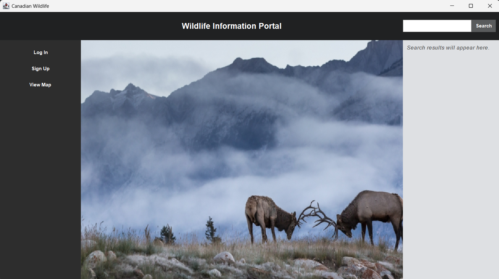
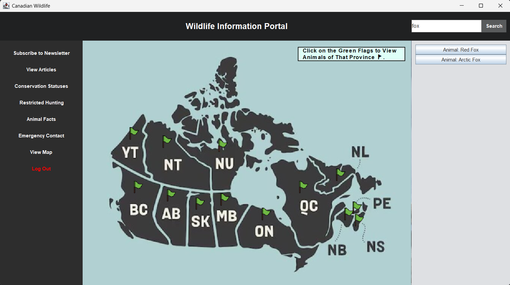
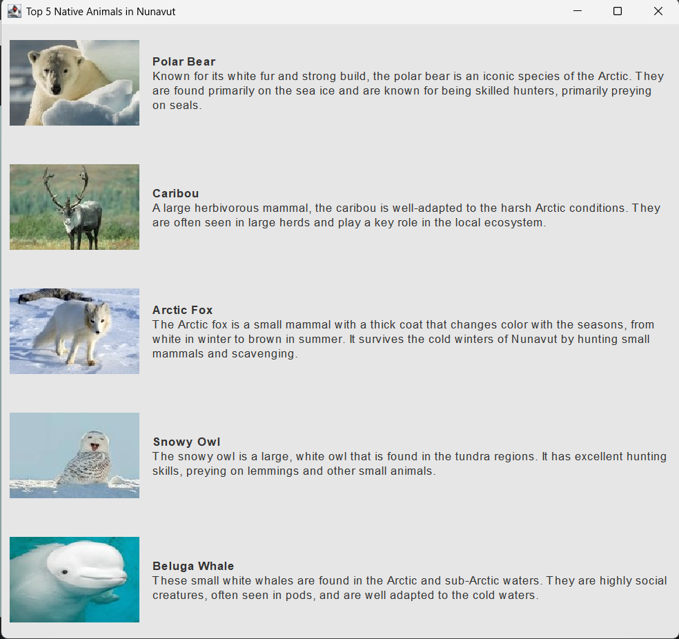
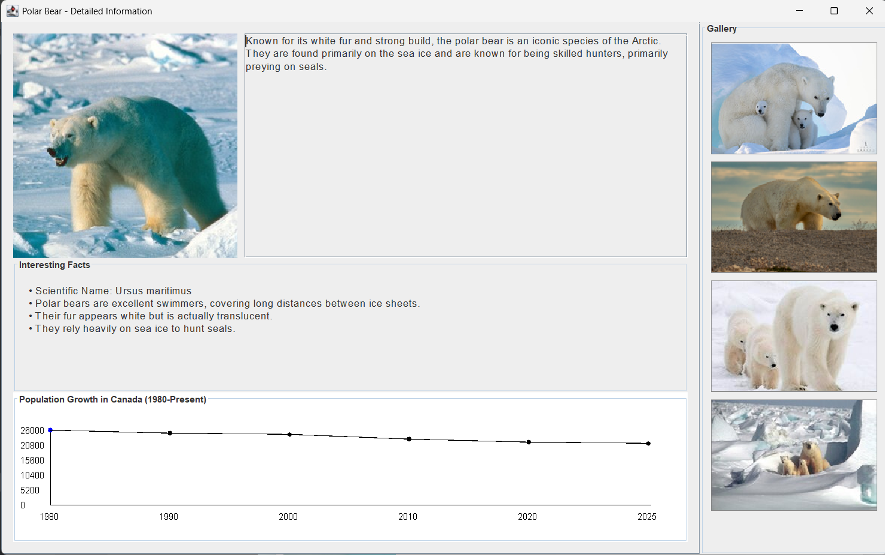
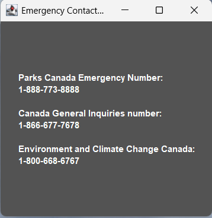
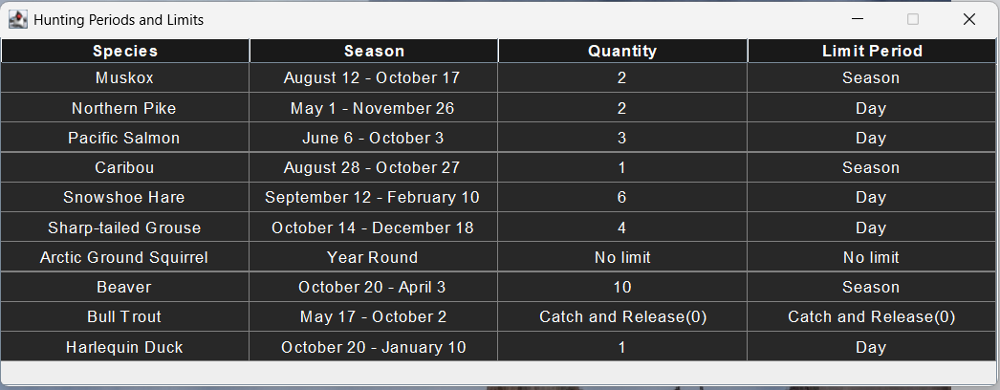
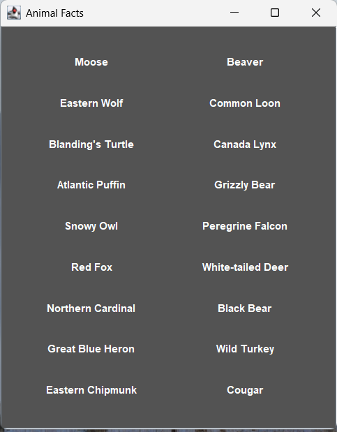
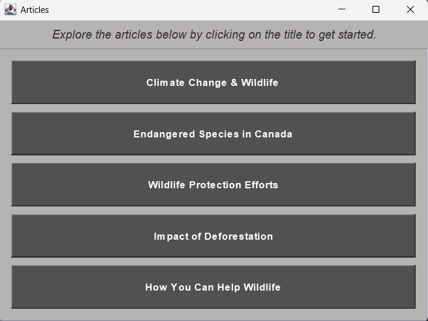

# Final Course Group Project 
Assignment completed for Software Design and Analysis for the Winter 2025 semester by:  
- Kamand Taghavi  
- Diana Riyahi  
- Muneeb Bhatti
- Jia Bernadette D Souza
- Davis Zhao

---

## Description  
In this final course assignment, our team developed the **Canadian Wildlife Portal**, an interactive Java-based desktop application that educates users about Canadian wildlife while promoting conservation efforts. The application allows users to explore an interactive map of Canada, select provinces, and view detailed species information including images, population data, and fun facts. Users can also access emergency contacts, learn about hunting regulations, and read wildlife-related articles.

Currently, animal data is fully available for the **Nunavut** region, while other provinces are under development.

---

## Interface and Main Functionalities  
The screenshots below will help describe the interface and main functionalities of the portal.

#### Figure 1  
Landing page of the application. From here, users can log in, sign up, or view the map to begin their exploration.  


#### Figure 2  
Interactive map of Canada where users can click green flags to view animals in that province.  


#### Figure 3  
Displays the top 5 native animals in Nunavut. Each entry contains an image and a brief description.  


#### Figure 4  
Detailed animal profile view for the polar bear. Includes a description, gallery, scientific facts, and a population growth chart.  


#### Figure 5  
Displays emergency contact information for wildlife-related issues.  


#### Figure 6  
Table showing restricted hunting periods and quantity limits for select Canadian species.  


#### Figure 7  
Animal facts window showcasing interesting species commonly found in Canada.  


#### Figure 8  
Curated wildlife articles addressing topics such as conservation, climate change, and endangered species.  


---

## Installation & Launch Instructions

### Requirements
- Java Development Kit (JDK) 17 or later
- [OpenCSV Library](http://opencsv.sourceforge.net/)
- IDE (IntelliJ IDEA or Eclipse) or Terminal

### Steps to Run the Project

1. **Clone the repository** (or download ZIP and extract):
```bash
git clone https://github.com/dianaRiyahi/CGHPM
cd CGHPM
```

2. **Add Required Library**  
   Ensure OpenCSV is added to the classpath. If using IntelliJ:
   - Go to *File > Project Structure > Libraries*
   - Click `+` and add the `opencsv-x.x.jar`

3. **Run the Application**
   - Open `MainFrame.java` in your IDE
   - Right-click the file and choose `Run MainFrame.main()`  
   OR use terminal:
```bash
javac -cp "lib/opencsv-x.x.jar" -d out src/main/java/org/example/*.java
java -cp "out:lib/opencsv-x.x.jar" org.example.MainFrame
```

---

## Project Structure

```plaintext
├── src
│   └── main
│       └── java
│           └── org
│               └── example
│                   ├── MainFrame.java
│                   └── dataReader.java
│
├── src
│   └── main
│       └── resources
│           ├── homepage_banner.jpg
│           ├── cad.jpg
│           ├── flag.png
│           ├── users.csv
│           ├── wildlife_data.csv
│           └── newsletter_subscriptions.csv
```

### File Descriptions

- **MainFrame.java**  
  The main class of the application. Launches the UI window and handles:
  - User login/sign-up
  - Interactive map rendering
  - Dynamic animal information loading
  - Newsletter subscriptions
  - Emergency contacts, animal facts, and articles display

- **dataReader.java**  
  Utility class that reads `wildlife_data.csv` to extract animal conservation statuses using OpenCSV and BufferedReader.

- **users.csv**  
  Stores usernames and passwords for login and registration.

- **wildlife_data.csv**  
  Holds animal species data, including name, population, diet, conservation status, and more.

- **newsletter_subscriptions.csv**  
  Contains entries submitted through the newsletter form: name, email, interests, and timestamp.

- **Images (homepage_banner.jpg, cad.jpg, flag.png)**  
  Visual assets for map background and province flags.

---


